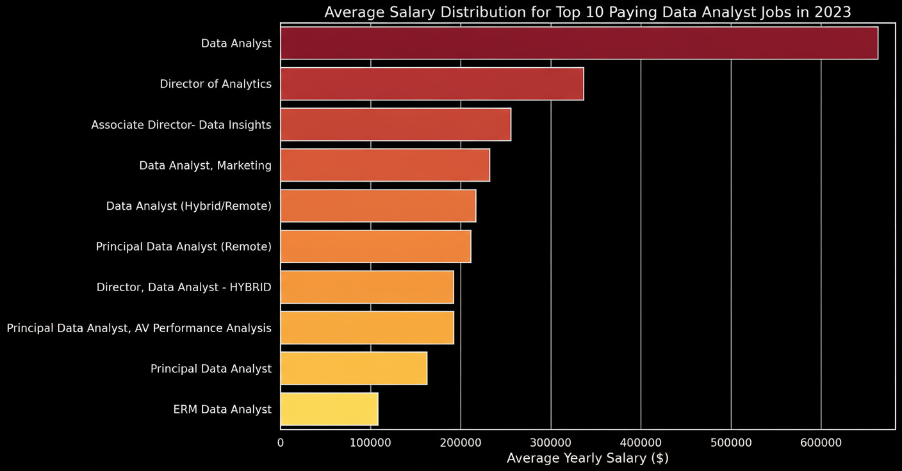
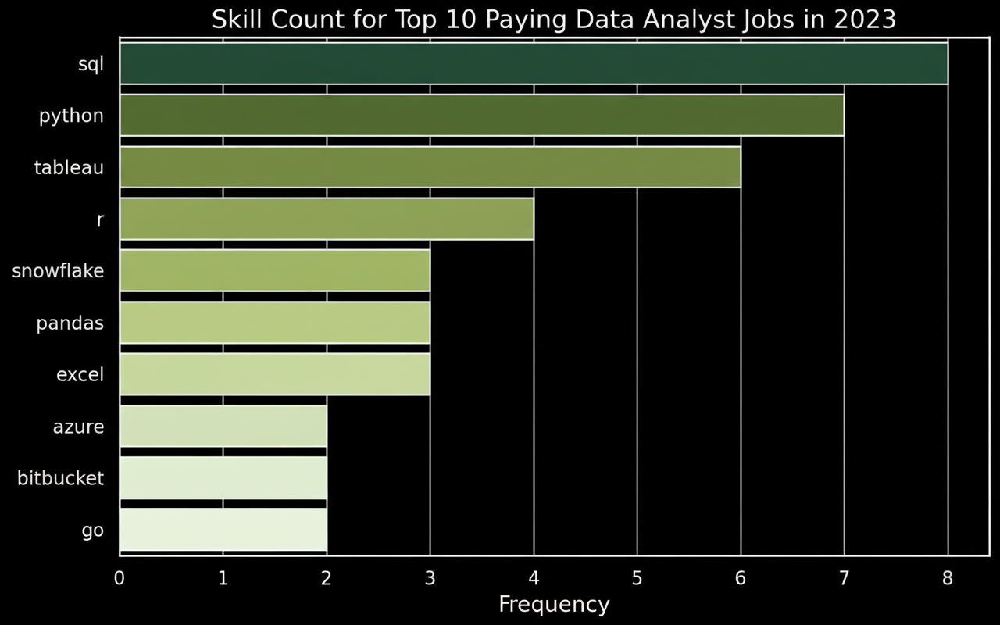

# Introduction
📊 Explore the data job landscape! This project dives into data analyst roles, uncovering 💰 the highest-paying positions, 🔥 the most sought-after skills, and 📈 how strong demand aligns with top salaries in data analytics.

🔍 Curious about SQL queries? Find them here: [project_sql folder](/project_sql/)

# Background
Motivated by a drive to better navigate the data analyst job market, this project aims to identify the highest-paying and most in-demand skills, helping others streamline their job search for the best opportunities.

### The questions I wanted to answer through my SQL queries were:

1. What are the top-paying data analyst jobs?
2. What skills are required for these top-paying jobs?
3. What skills are most in demand for data analysts?
4. Which skills are associated with higher salaries?
5. What are the most optimal skills to learn?

# Tools I Used
For my deep dive into the data analyst job market, I harnessed the power of several key tools:

- **SQL:** The backbone of my analysis, allowing me to query the database and unearth critical insights.
- **PostgreSQL:** The chosen database management system, ideal for handling the job posting data.
- **Visual Studio Code:** My go-to for database management and executing SQL queries.
- **Git & GitHub:** Essential for version control and sharing my SQL scripts and analysis, ensuring collaboration and project tracking.

# The Analysis
Each query for this project aimed at investigating specific aspects of the data analyst job market. Here’s how I approached each question:


### 1. Top Paying Data Analyst Jobs
To identify the highest-paying roles, I filtered data analyst positions by average yearly salary and location, focusing on remote jobs. This query highlights the high paying opportunities in the field.

```sql
SELECT	
	job_id,
	job_title,
	job_location,
	job_schedule_type,
	salary_year_avg,
	job_posted_date,
    name AS company_name
FROM
    job_postings_fact
LEFT JOIN company_dim ON job_postings_fact.company_id = company_dim.company_id
WHERE
    job_title_short = 'Data Analyst' AND 
    job_location = 'Anywhere' AND 
    salary_year_avg IS NOT NULL
ORDER BY
    salary_year_avg DESC
LIMIT 30;

```
Here's the breakdown of the top data analyst jobs in 2023:
- **Wide Salary Range:** Top 10 paying data analyst roles span from $184,000 to $650,000, indicating significant salary potential in the field.
- **Diverse Employers:** Companies like SmartAsset, Meta, and AT&T are among those offering high salaries, showing a broad interest across different industries.
- **Job Title Variety:** There's a high diversity in job titles, from Data Analyst to Director of Analytics, reflecting varied roles and specializations within data analytics.


*Bar graph displaying the top 10 data analyst salaries, generated by ChatGPT using the results from my SQL query.*

### 2. Skills for Top Paying Jobs
To understand what skills are required for the top-paying jobs, I joined the job postings with the skills data, providing insights into what employers value for high-compensation roles.
```sql
WITH top_paying_jobs AS (
    SELECT	
        job_id,
        job_title,
        salary_year_avg,
        name AS company_name
    FROM
        job_postings_fact
    LEFT JOIN company_dim ON job_postings_fact.company_id = company_dim.company_id
    WHERE
        job_title_short = 'Data Analyst' AND 
        job_location = 'Anywhere' AND 
        salary_year_avg IS NOT NULL
    ORDER BY
        salary_year_avg DESC
    LIMIT 30
)

SELECT 
    top_paying_jobs.*,
    skills
FROM top_paying_jobs
INNER JOIN skills_job_dim ON top_paying_jobs.job_id = skills_job_dim.job_id
INNER JOIN skills_dim ON skills_job_dim.skill_id = skills_dim.skill_id
ORDER BY
    salary_year_avg DESC;
```
Here's the breakdown of the most demanded skills for the top 10 highest paying data analyst jobs in 2023:
- **SQL** is leading with a bold count of 8.
- **Python** follows closely with a bold count of 7.
- **Tableau** is also highly sought after, with a bold count of 6.
Other skills like **R**, **Snowflake**, **Pandas**, and **Excel** show varying degrees of demand.


*Bar graph visualizing the count of skills for the top 10 paying jobs for data analysts; ChatGPT generated this graph from my SQL query results*

### 3. In-Demand Skills for Data Analysts

This query helped identify the skills most frequently requested in job postings, directing focus to areas with high demand.

```sql
SELECT 
    skills,
    COUNT(skills_job_dim.job_id) AS demand_count
FROM job_postings_fact
INNER JOIN skills_job_dim ON job_postings_fact.job_id = skills_job_dim.job_id
INNER JOIN skills_dim ON skills_job_dim.skill_id = skills_dim.skill_id
WHERE
    job_title_short = 'Data Analyst' 
    AND job_work_from_home = True 
GROUP BY
    skills
ORDER BY
    demand_count DESC
LIMIT 15;

```
Here's the breakdown of the most demanded skills for data analysts in 2023
- **SQL** and **Excel** remain fundamental, emphasizing the need for strong foundational skills in data processing and spreadsheet manipulation.
- **Programming** and **Visualization Tools** like **Python**, **Tableau**, and **Power BI** are essential, pointing towards the increasing importance of technical skills in data storytelling and decision support.

| Skills   | Demand Count |
|----------|--------------|
| SQL      | 7291         |
| Excel    | 4611         |
| Python   | 4330         |
| Tableau  | 3745         |
| Power BI | 2609         |

*Table of the demand for the top 5 skills in data analyst job postings*

### 4. Skills Based on Salary
Exploring the average salaries associated with different skills revealed which skills are the highest paying.
```sql
SELECT 
    skills,
    ROUND(AVG(salary_year_avg), 0) AS avg_salary
FROM job_postings_fact
INNER JOIN skills_job_dim ON job_postings_fact.job_id = skills_job_dim.job_id
INNER JOIN skills_dim ON skills_job_dim.skill_id = skills_dim.skill_id
WHERE
    job_title_short = 'Data Analyst'
    AND salary_year_avg IS NOT NULL
    AND job_work_from_home = True 
GROUP BY
    skills
ORDER BY
    avg_salary DESC
LIMIT 40;
```
Here's a breakdown of the results for top paying skills for Data Analysts:
- **High Demand for Big Data & ML Skills:** Top salaries are commanded by analysts skilled in big data technologies (PySpark, Couchbase), machine learning tools (DataRobot, Jupyter), and Python libraries (Pandas, NumPy), reflecting the industry's high valuation of data processing and predictive modeling capabilities.
- **Software Development & Deployment Proficiency:** Knowledge in development and deployment tools (GitLab, Kubernetes, Airflow) indicates a lucrative crossover between data analysis and engineering, with a premium on skills that facilitate automation and efficient data pipeline management.
- **Cloud Computing Expertise:** Familiarity with cloud and data engineering tools (Elasticsearch, Databricks, GCP) underscores the growing importance of cloud-based analytics environments, suggesting that cloud proficiency significantly boosts earning potential in data analytics.

| Skills        | Average Salary ($) |
|---------------|-------------------:|
| pyspark       |            208,172 |
| bitbucket     |            189,155 |
| couchbase     |            160,515 |
| watson        |            160,515 |
| datarobot     |            155,486 |
| gitlab        |            154,500 |
| swift         |            153,750 |
| jupyter       |            152,777 |
| pandas        |            151,821 |
| elasticsearch |            145,000 |

*Table of the average salary for the top 10 paying skills for data analysts*

### 5. Most Optimal Skills to Learn

Combining insights from demand and salary data, this query aimed to pinpoint skills that are both in high demand and have high salaries, offering a strategic focus for skill development.

```sql
SELECT 
    skills_dim.skill_id,
    skills_dim.skills,
    COUNT(skills_job_dim.job_id) AS demand_count,
    ROUND(AVG(job_postings_fact.salary_year_avg), 2) AS avg_salary
FROM job_postings_fact
INNER JOIN skills_job_dim ON job_postings_fact.job_id = skills_job_dim.job_id
INNER JOIN skills_dim ON skills_job_dim.skill_id = skills_dim.skill_id
WHERE
    job_title_short = 'Data Analyst'
    AND salary_year_avg IS NOT NULL
    AND job_work_from_home = True 
GROUP BY
    skills_dim.skill_id
HAVING
    COUNT(skills_job_dim.job_id) > 10
ORDER BY
    avg_salary DESC,
    demand_count DESC
LIMIT 40;
```

| Skill ID | Skills     | Demand Count | Average Salary ($) |
|----------|------------|--------------|-------------------:|
| 8        | go         | 27           |            115,320 |
| 234      | confluence | 11           |            114,210 |
| 97       | hadoop     | 22           |            113,193 |
| 80       | snowflake  | 37           |            112,948 |
| 74       | azure      | 34           |            111,225 |
| 77       | bigquery   | 13           |            109,654 |
| 76       | aws        | 32           |            108,317 |
| 4        | java       | 17           |            106,906 |
| 194      | ssis       | 12           |            106,683 |
| 233      | jira       | 20           |            104,918 |

*Table of the most optimal skills for data analyst sorted by salary*

Here's a breakdown of the most optimal skills for Data Analysts in 2023: 
- **High-Demand Programming Languages:** Python and R stand out for their high demand, with demand counts of 236 and 148 respectively. Despite their high demand, their average salaries are around $101,397 for Python and $100,499 for R, indicating that proficiency in these languages is highly valued but also widely available.
- **Cloud Tools and Technologies:** Skills in specialized technologies such as Snowflake, Azure, AWS, and BigQuery show significant demand with relatively high average salaries, pointing towards the growing importance of cloud platforms and big data technologies in data analysis.
- **Business Intelligence and Visualization Tools:** Tableau and Looker, with demand counts of 230 and 49 respectively, and average salaries around $99,288 and $103,795, highlight the critical role of data visualization and business intelligence in deriving actionable insights from data.
- **Database Technologies:** The demand for skills in traditional and NoSQL databases (Oracle, SQL Server, NoSQL) with average salaries ranging from $97,786 to $104,534, reflects the enduring need for data storage, retrieval, and management expertise.

**What I Learned**

Throughout this journey, I supercharged my SQL skills with some powerful upgrades:

🧩 **Complex Query Crafting**: Honed the ability to build advanced SQL queries, seamlessly joining tables and mastering WITH clauses for efficient temporary table creation.
📊 **Data Aggregation**: Gained mastery over GROUP BY and aggregate functions like COUNT() and AVG() to produce clear, insightful summaries.
💡 **Analytical Wizardry**: Strengthened real-world problem-solving abilities by transforming complex questions into meaningful, data-driven insights through SQL.

# Conclusions

### Insights
From the analysis, several key insights stood out:

1. **Top-Paying Data Analyst Roles**: Remote data analyst positions offer a wide salary range, with the top salary reaching $650,000.
2. **Skills Behind High Salaries**: Advanced proficiency in SQL is a common requirement among top-paying roles, highlighting its importance for those aiming for higher earnings.
3. **Most In-Demand Skill**: SQL dominates the job market in demand, making it a must-have for aspiring data analysts.
4. **High-Value Specialized Skills**: Niche skills like SVN and Solidity correlate with the highest average salaries, showing strong demand for specialized expertise.
5. **Best Skill for Market Value**: Combining high demand and strong salary potential, SQL stands out as one of the most valuable skills for maximizing career opportunities in data analytics.

### Closing Thoughts

This project strengthened my SQL expertise and offered meaningful insights into the data analyst job market. The analysis provides a roadmap for prioritizing skill development and optimizing job search strategies. Aspiring data analysts can gain a competitive edge by focusing on skills that are both in high demand and high-paying. Overall, this exploration underscores the importance of continuous learning and staying adaptable to evolving trends in data analytics.